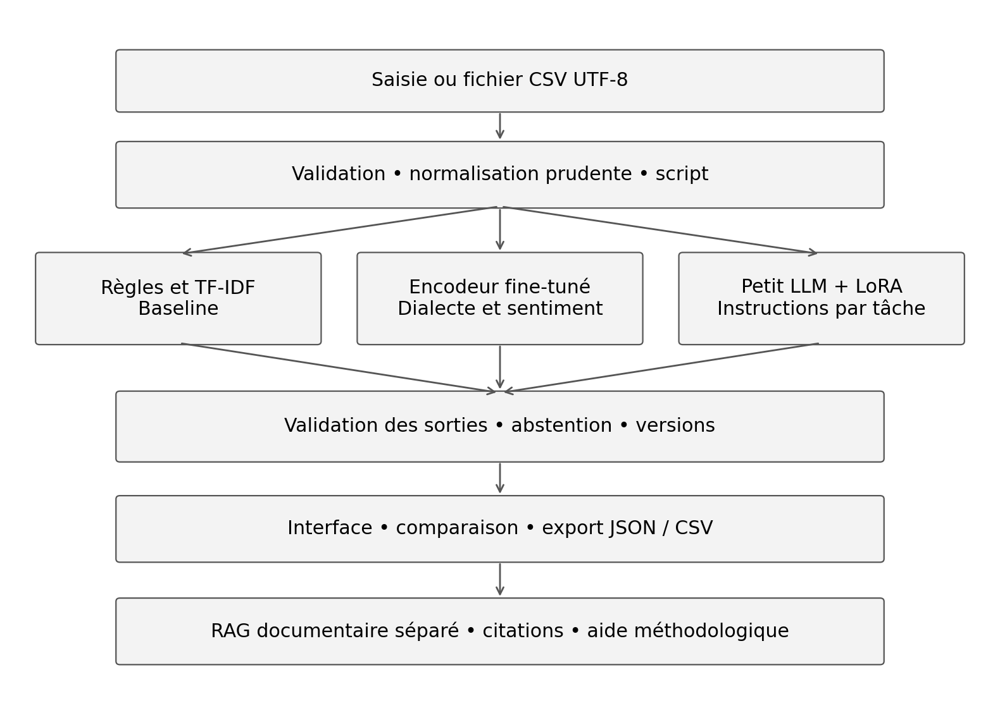

# Cahier des charges NLP Arabe 5 etudiants 2026-2027

# Cahier des charges du projet NLP arabe

Analyse du tunisien et de l’arabe standard avec Transformers et fine tuning

Cycle ingénieur • 5e année DS et DEV • Équipe de cinq étudiants

Année universitaire 2026–2027 | Version 1 | 2 octobre 2026

## Mission

Concevoir, entraîner, évaluer et intégrer un système NLP qui identifie une variété d’arabe et analyse le sentiment de textes tunisiens. Le projet compare des méthodes classiques, un encodeur Transformer adapté et un petit modèle génératif adapté par LoRA. Il étudie les difficultés liées à l’écriture arabe, à l’Arabizi et au mélange avec le français ou l’anglais.

Le produit attendu est une application expérimentale accompagnée de données documentées, de notebooks relançables, de modèles sauvegardés et d’un rapport scientifique. Une interface commune expose les traitements ; un même LLM et un adaptateur multitâche traitent les deux tâches par des instructions distinctes. La couverture de tous les dialectes arabes constitue une perspective de recherche.

| **Cadre** | **Exigence** |
| --- | --- |
| Durée proposée | 10 semaines, avec une démonstration initiale en semaine 7 |
| Équipe | 1 membre, |
| Tâches centrales | Identification MSA / tunisien / égyptien ; sentiment tunisien positif / négatif |
| Apprentissage obligatoire | Fine-tuning d’un encodeur et instruction tuning LoRA d’un petit LLM |
| Ressources | Colab ou Kaggle ; modèles entraînés ≤ 1 milliard de paramètres ; aucune API payante |
| Évaluation | Baselines, 3 graines, test figé, ablations, résultats par script et analyse d’erreurs |

Le calendrier relatif et les budgets ci-dessous constituent le cadre proposé pour ce sujet. Les dates effectives sont fixées au lancement du module. La pondération de 60 % pour le projet reprend le PDF de référence et s’applique si ce cadre est confirmé par l’enseignant.

# 1 Analyse de la proposition initiale

Le fichier Sujet\_\_NLP\_Arabe.docx présente une proposition doctorale intitulée Towards a Unified LLM for Arabic Dialects and MSA with Efficient Low-Resource Adaptation. Son idée directrice est pertinente pour le module : mesurer l’adaptation d’un modèle à des variétés peu dotées, au lieu de supposer que les performances en arabe standard se généralisent au tunisien.

## Éléments à conserver

La priorité au tunisien et aux données peu dotées, la comparaison entre variétés linguistiques et les résultats séparés par script.

L’adaptation économique par LoRA ou QLoRA, les cartes de données et l’étude du compromis entre performance et coût.

Une chaîne de traitement intégrée et une analyse explicite des erreurs liées à l’orthographe, à la négation et au code-switching.

| **Proposition ** | **Adaptation pour le semestre** |
| --- | --- |
| MSA et grands groupes dialectaux | MSA, tunisien et égyptien pour une première expérience ; autres dialectes en extension |
| NER, sentiment, dialecte et traduction | Deux tâches obligatoires ; NER ou traduction comme extension unique après validation du socle |
| Corpus multivariété et active learning | Réutilisation de corpus identifiés et petit jeu de robustesse annoté ; active learning optionnel |
| Normalisation Arabizi neuronale | Traitement prudent et baseline par règles ; module appris uniquement avec données parallèles suffisantes |
| Adaptateurs propres aux dialectes | Un adaptateur LoRA multitâche partagé ; adaptateurs séparés comme comparaison Gold |
| Comparaison avec full fine-tuning | Full fine-tuning de l’encodeur ; LoRA du LLM. Ce contraste ne constitue pas une comparaison à architecture constante |

## Corrections scientifiques nécessaires

L’affirmation selon laquelle les LLM se dégradent fortement sur tous les dialectes doit devenir une hypothèse mesurée pour un modèle, une tâche et un corpus précis. L’Arabizi n’a pas de translittération universelle et le mélange de langues n’indique pas automatiquement un dialecte. La nouveauté scientifique du système doit être discutée après lecture des travaux cités ; elle ne découle pas du seul assemblage de composants.

Le PDF référence Ch1 à Ch11, mais mentionne parfois Ch12 sans le définir et décrit le lot E comme partagé entre quatre membres. Le présent sujet utilise Ch1 à Ch11 et attribue le pilotage du lot E au cinquième membre, avec contribution de toute l’équipe.

# 2 Objectifs pédagogiques et lien avec le cours

À la fin du projet, chaque étudiant doit pouvoir expliquer les données utilisées, construire une baseline, décrire le rôle de l’attention, justifier un fine-tuning, interpréter les métriques et relancer le système. Le partage des lots organise le travail sans limiter l’apprentissage individuel.

| **Chapitre** | **Travail concret** | **Preuve attendue** |
| --- | --- | --- |
| Ch1 Fondements | Définir tâches, labels et usages | Carte du système et protocole |
| Ch2 Lexique et morphologie | Nettoyer, segmenter, analyser les sous-mots | Normaliseur et audit des tokenizers |
| Ch3 Syntaxe | Étudier négation, POS et patrons sur un échantillon | Analyse de 50 phrases et erreurs |
| Ch4 Sens et pragmatique | Distinguer polarité, ironie et cible du sentiment | Guide d’annotation et cas ambigus |
| Ch5 Représentations | Comparer TF-IDF, embeddings et réseau léger | Tableau de baselines |
| Ch6 Langage et attention | N-grammes et BiGRU ; fonctionnement du Transformer | Notebook explicatif et comparaison |
| Ch7 BERT et fine-tuning | Adapter un encodeur aux deux tâches | Checkpoints et courbes |
| Ch8 LLM et instructions | Zero-shot, few-shot et SFT LoRA | Adaptateur partagé et sorties validées |
| Ch9 Recherche et RAG | Interroger une petite base de connaissances NLP | Retrieval lexical puis dense, citations |
| Ch10 Arabe et langues peu dotées | Tester tunisien, MSA, autre dialecte et scripts | Courbes d’apprentissage et résultats par groupe |
| Ch11 Audit | Mesurer robustesse, abstention et limites | Rapport d’audit et erreurs catégorisées |

## Question principale de recherche

Avec un budget de données et de calcul limité, l’adaptation LoRA d’un petit LLM améliore-t-elle l’identification dialectale et le sentiment tunisien par rapport au même LLM sans adaptation ? Le comparer ensuite à un encodeur fine-tuné et à TF-IDF permet d’examiner l’utilité du modèle génératif pour des tâches de classification.

## Questions secondaires

La normalisation prudente améliore-t-elle le sentiment sans détruire la négation ou les indices dialectaux ?

Quel niveau de performance obtient-on avec 10 %, 25 %, 50 % et 100 % des données d’entraînement ?

Un gain moyen masque-t-il une dégradation sur l’Arabizi ou les textes contenant du français ?

# 3 Périmètre fonctionnel et niveaux de priorité

La classification dialectale porte sur les classes présentes dans le corpus retenu. MSA désigne l’arabe standard moderne ; TN regroupe Tunis et Sfax ; EG représente l’égyptien du Caire dans l’expérience MADAR. Ces classes ne constituent pas une taxonomie complète des langues ou dialectes.

| **ID** | **Fonction attendue** | **Priorité et validation** |
| --- | --- | --- |
| F01 | Saisir un texte ou importer un CSV UTF-8 | Obligatoire ; contrôle des colonnes et erreurs par ligne |
| F02 | Afficher texte brut, texte normalisé et type de script | Obligatoire ; aucune modification silencieuse |
| F03 | Identifier MSA, TN ou EG | Obligatoire ; label, scores de l’encodeur et abstention |
| F04 | Analyser le sentiment tunisien POS ou NEG | Obligatoire ; domaine déclaré, résultat et incertitude |
| F05 | Comparer baseline, encodeur et LLM | Obligatoire ; mêmes exemples et mêmes labels |
| F06 | Exécuter un LLM avant et après LoRA | Obligatoire ; tâches distinguées par instruction et sortie structurée |
| F07 | Répondre à des questions sur la méthode par RAG | Obligatoire mais limité ; passages cités ou abstention |
| F08 | Exporter prédictions et métadonnées en JSON ou CSV | Obligatoire ; versions et identifiants des entrées |
| F09 | Afficher les métriques et erreurs du test figé | Obligatoire ; séparation test et saisie libre |
| F10 | NER avec PER, ORG et LOC | Extension ; corpus, offsets, métriques strictes |
| F11 | Reformulation tunisien vers MSA | Extension ; paires validées, omissions et fidélité humaine |
| F12 | Active learning ou adaptateurs dialectaux | Extension Gold ; comparaison à budget constant |

## Règles de comportement

Le sentiment est appris sur des avis tunisiens positifs ou négatifs. Le système ne prétend pas reconnaître une classe neutre absente des données. Pour les textes neutres, ambigus, exclusivement français ou hors domaine, il doit pouvoir signaler une limite ou s’abstenir. En mode comparaison scientifique, toutes les branches sont évaluées sur les mêmes exemples, sans filtrage selon le dialecte prédit.

L’entraînement de zéro d’un grand LLM, l’audio, les agents autonomes, le déploiement commercial et l’ajout d’un module quantique ne font pas partie du socle. Une seule extension substantielle est retenue après obtention du niveau Silver.

# 4 Architecture du système et responsabilités des modèles

Le système comporte une chaîne de données hors ligne pour l’apprentissage et une chaîne d’inférence pour l’application. Les deux partagent le tokenizer, les règles de normalisation et les mappings de labels versionnés. Les corpus de test restent exclus des index de recherche.

Figure 1 Architecture d’inférence et séparation de l’assistance documentaire

## Rôle exact de chaque branche

L’encodeur utilise une tête de classification par tâche. Deux checkpoints séparés sont acceptés pour simplifier l’implémentation ; un encodeur partagé à deux têtes constitue une extension. Le LLM utilise obligatoirement un même checkpoint de base et un adaptateur partagé entraîné sur des instructions mixtes. Les données ne disposent pas nécessairement des deux labels pour une même phrase : aucune étiquette manquante ne doit être inventée.

Le RAG explique le protocole et les limites à partir de fiches vérifiées. Ses références documentaires ne prouvent pas que le sentiment d’un nouveau texte est correct. Les scores d’attention ou une justification générée ne constituent pas, seuls, une explication fidèle du modèle.

# 5 Corpus et stratégie de constitution des données

Le corpus initial réutilise des ressources identifiées plutôt que de demander aux étudiants d’annoter des milliers de phrases. Les effectifs ci-dessous sont des cibles de travail ; les effectifs réels après nettoyage figurent dans la carte de données. Les conditions de réutilisation et de redistribution sont contrôlées avant toute diffusion.

| **Ressource** | **Usage et cible** | **Limites à documenter** |
| --- | --- | --- |
| MADAR Corpus-26 [S3] | Sélection MSA, Tunis, Sfax et Cairo ; jusqu’à 8 000 lignes, issues de 2 000 phrases parallèles | Domaine du voyage ; Tunis et Sfax ne couvrent pas tout le tunisien ; accès sous conditions |
| TSAC [S4 et S5] | Sentiment POS / NEG ; minimum proposé 4 000 lignes exploitables, préférer le train complet si faisable | Environ 17 000 commentaires dans la ressource originale ; données anciennes et liées aux réseaux sociaux |
| Jeu local de robustesse | 300 avis tunisiens : 100 écriture arabe, 100 Arabizi, 100 mélange de langues | Création humaine indépendante ; au moins 100 POS et 100 NEG ; cas ambigus en sous-ensemble distinct |
| Jeu local dialectal | 150 phrases : 50 MSA, 50 TN, 50 EG ; contrôler le niveau de compétence des annotateurs | Jeu de défi réduit ; variété EG validée par une personne compétente ou remplacée par données autorisées |
| Base de connaissances RAG | 40 à 60 fiches originales de 100 à 200 mots sur le protocole et le NLP arabe | Fiches validées, identifiants stables, références ; ne pas recopier les articles intégraux |

## Accès et solution de repli

MADAR couvre 25 villes et MSA ; Corpus-26 comporte 2 000 phrases sources traduites dans ces variétés. Ses versions française et anglaise ne sont pas incluses dans la distribution annoncée pour des raisons de droits [S3]. Ne pas supposer leur disponibilité pour une extension de traduction. La licence de recherche est non commerciale [S6].

Dès la semaine 1, vérifier l’accès aux fichiers. Si MADAR n’est pas accessible à la fin de la semaine 2, fournir un corpus autorisé de même domaine pour MSA et TN, avec au moins 600 exemples par classe et labels validés. Passer à deux classes constitue un changement de périmètre à consigner et à faire valider au jalon J1. Le sentiment tunisien et le fine-tuning restent obligatoires.

Ne pas attribuer TN à tous les textes d’une page tunisienne ni MSA à tous les textes d’un journal. La provenance géographique n’est pas une annotation linguistique. Des jeux issus de domaines différents ne permettent pas, seuls, de conclure à un transfert dialectal.

# 6 Schéma des données et prévention des fuites

| **Champ** | **Type et règle** |
| --- | --- |
| id | Chaîne unique et stable |
| text\_raw et text\_norm | UTF-8 ; conserver la version brute, tracer les transformations |
| task et label | dialect : MSA / TN / EG ; sentiment : POS / NEG ; un label absent reste absent |
| script et languages | AR / LATIN / MIXED ; arabe, français, anglais et indéterminé au niveau défini par le guide |
| source et source\_id | Corpus, version, fichier et numéro de ligne ; éviter les informations personnelles |
| group\_id | Phrase source MADAR, conversation, auteur si autorisé, ou famille de variantes |
| split | train / validation / test / challenge ; fixé avant l’apprentissage |
| annotation\_status | originale / doublement annotée / arbitrée / ambiguë / synthétique |
| license et normalization\_version | Conditions de réutilisation et identifiant du prétraitement |

## Séparation des jeux

MADAR : conserver les partitions officielles si elles garantissent le regroupement ; sinon créer un split groupé 70 / 15 / 15 sur l’identifiant de phrase source. Les traductions d’une même phrase restent ensemble, y compris lors des deux tâches d’une extension.

TSAC : préserver le test officiel pour la reproduction ; extraire la validation uniquement du train. Vérifier doublons et quasi-doublons entre fichiers. Si une décontamination modifie le benchmark, publier séparément le score officiel et le score nettoyé.

Les sous-échantillons d’apprentissage, l’augmentation, les few-shots et toute indexation d’exemples utilisent uniquement le train. Une variante Arabizi et sa phrase d’origine appartiennent au même groupe.

Les jeux locaux de défi sont gelés avant la sélection des modèles et examinés seulement à l’évaluation finale. La validation sert à ajuster hyperparamètres, seuils et prompts.

## Contrôles obligatoires

Détecter les doublons exacts après normalisation légère ; examiner les similarités élevées avec n-grammes de caractères. Enregistrer les suppressions et les conflits de labels. Si les identifiants d’auteur ou de conversation sont absents, déclarer que l’indépendance de ces groupes ne peut pas être vérifiée. Sauvegarder les manifestes, les graines du split et les empreintes SHA-256 des fichiers.

La normalisation apprise, les vocabulaires TF-IDF, les lexiques induits et les statistiques de sélection sont ajustés sur le train. Le test ne sert ni à sélectionner une ablation ni à corriger une règle. Un défaut découvert sur le test est consigné et traité lors d’une version ultérieure avec un nouveau protocole.

# 7 Annotation et traitement de la langue

## Guide d’annotation

Définir POS comme une appréciation favorable explicite et NEG comme une appréciation défavorable explicite de la cible du commentaire. Les avis contenant des polarités opposées, une ironie incertaine ou aucune appréciation sont marqués ambigus dans le jeu local ; ils ne sont pas forcés dans les deux classes du train. Le guide doit préciser la cible, le traitement de la négation et les expressions composées.

Pour le dialecte, annoter la variété dominante seulement lorsque les indices sont suffisants. Les phrases identiques entre plusieurs variétés ou très courtes peuvent rester indéterminées dans le jeu de défi. L’incertitude annotative et l’abstention du système constituent deux champs différents.

| **Étape** | **Procédure et preuve** |
| --- | --- |
| Calibration | Deux annotateurs traitent indépendamment 50 exemples ; discuter ensuite les désaccords et versionner le guide |
| Double annotation | Au moins 150 avis locaux et 100 phrases dialectales, avant tout arbitrage ; répartir scripts et labels |
| Accord | Cohen kappa pour les labels catégoriels, accord brut et matrice de désaccord ; seuil de travail visé 0,70 |
| Arbitrage | Troisième membre ou enseignant ; conserver labels initiaux et décision finale |
| Révision | Si kappa < 0,70, clarifier le guide et refaire un lot de calibration ; ne pas modifier l’accord historique |
| Qualité | Une annotation proposée par IA est marquée comme telle ; elle ne compte pas comme jugement humain indépendant |

## Normalisation prudente

Uniformiser espaces et Unicode, retirer tatweel si utile, remplacer URL et mentions personnelles par des marqueurs stables. Tester les décisions sur les voyelles et variantes d’alif par ablation.

Conserver les marqueurs de négation, les chiffres employés dans l’Arabizi et les mots français ou anglais. Les emojis et répétitions peuvent porter le sentiment ; comparer conservation et suppression.

Ne pas transformer automatiquement chaque 3 ou 7 en lettre arabe. Appliquer un petit lexique réversible à des expressions identifiées ; laisser les cas inconnus et tracer les modifications.

Exemples pédagogiques écrits pour le projet : « el service behi barcha » exprime une appréciation favorable ; « el service moch behi » contient une négation ; « service behi ama livraison très lente » exprime un avis mixte. Les exemples et leurs variantes doivent être validés par des annotateurs compétents. La translittération préserve le dialecte ; elle ne constitue pas une traduction vers MSA.

# 8 Analyse linguistique et baselines

Avant tout fine-tuning, construire des références mesurables. Les baselines sont entraînées et évaluées sur les mêmes partitions que les modèles adaptés. Une baseline forte facilite l’interprétation d’un résultat négatif du LLM.

| **Composant** | **Configuration initiale** | **Évaluation** |
| --- | --- | --- |
| Référence triviale | Classe majoritaire ; fréquences calculées sur le train | Accuracy et macro-F1 |
| Règles linguistiques | Lexique de sentiment, négation et indices dialectaux ; règles documentées | Macro-F1 et couverture |
| TF-IDF mots | N-grammes 1–2 et régression logistique | Même test, poids des termes et erreurs |
| TF-IDF caractères | N-grammes 3–5 et classifieur linéaire ; hyperparamètres sur validation | Baseline principale contre variations orthographiques |
| Baseline neuronale légère | Embedding appris sur train et BiGRU avec pooling ; même budget de recherche | Moyenne et écart-type sur trois graines |
| Encodeur gelé | Embeddings moyens avec masque, encodeur en mode évaluation, tête linéaire apprise | Effet de l’adaptation des représentations |
| Modèle de langage | N-grammes de caractères avec lissage ; longueur et vocabulaire constants | Perplexité pour une seule représentation comparable |

## Travail de syntaxe et de pragmatique

Étudier au moins 50 phrases réparties entre MSA et tunisien : mots porteurs de polarité, portée de la négation, cible de l’avis et ironie. Employer un outil POS disponible ou une annotation manuelle légère. Si un analyseur MSA est appliqué au tunisien, évaluer ses erreurs ; ne pas présenter ses sorties comme une vérité terrain dialectale.

Tester une règle de portée locale de la négation et comparer ses erreurs avec celles du classifieur. Une feature syntaxique n’est intégrée au système que si son gain ou son utilité est mesuré. Les catégories d’erreurs communes comprennent négation, sarcasme, mot polysémique, expression rare, script et domaine.

## Ablation du lot B

Comparer mots seuls, caractères seuls et combinaison des deux sur la validation. Tester ensuite l’ajout du lexique ou de la négation au meilleur système classique. Préenregistrer le contraste final avant l’ouverture du test. La perplexité de deux tokenizers différents n’est pas directement comparable ; pour l’audit linguistique, conserver le même modèle et la même unité.

# 9 Choix des Transformers et justification

Le choix des modèles privilégie une expérience relançable sur les ressources étudiantes. Le nombre exact de paramètres, la licence et la révision utilisée sont enregistrés lors du téléchargement. Le nom commercial d’un modèle ne remplace pas cette vérification.

| **Modèle ou famille** | **Rôle retenu** | **Justification et limite** |
| --- | --- | --- |
| CAMeL-Lab/bert-base-arabic-camelbert-mix [S1] | Encodeur principal à fine-tuner | Préentraîné sur un mélange MSA, dialectal et classique ; compact. L’Arabizi et le français demandent un audit spécifique |
| Qwen/Qwen3-0.6B [S2] | LLM principal ; base unique puis LoRA multitâche | Modèle causal annoncé à 0,6B, sous le plafond de 1B ; gabarit de dialogue et mode sans thinking. La compétence tunisienne reste à mesurer |
| Encodeur multilingue de petite taille | Comparaison optionnelle ou repli pour code-switching | À sélectionner après audit des sous-mots et de la licence ; aucun gain arabe supposé |
| Jais, AceGPT et Atlas-Chat | Références pour l’état de l’art | Littérature utile pour l’adaptation arabe ; les grands checkpoints ne sont pas requis pour ce projet |

## Justification du choix final

L’encodeur fournit un système spécialisé de classification avec scores par classe. Le petit LLM permet de pratiquer l’instruction tuning et de comparer un modèle génératif avant et après adaptation. Leur performance ne doit pas être confondue avec leur capacité à produire du texte fluide. Un LLM moins performant que TF-IDF peut donner lieu à une excellente étude si l’expérience est correcte.

## Audit préalable des tokenizers

Sur au moins 100 textes de chaque script disponibles dans le train ou la validation, mesurer nombre de sous-mots par mot, taux de tokens inconnus s’il existe, longueur et taux de troncature. Inspecter négations, emojis et séquences Arabizi. Choisir les longueurs maximales à partir de ces résultats, sans consulter le test.

## Contraintes techniques

Utiliser un checkpoint CAMeLBERT général et ajouter une tête avec AutoModelForSequenceClassification ; un checkpoint déjà adapté sur le test choisi ne constitue pas une baseline indépendante. Pour Qwen, employer le chat template officiel avec enable\_thinking=False et figer une version compatible de Transformers, PEFT et des dépendances. Les bibliothèques doivent reconnaître l’architecture qwen3 [S2].

Colab constitue le notebook de référence proposé ; Kaggle reste une alternative à environnement équivalent. La disponibilité et les quotas GPU ne sont pas garantis. Enregistrer matériel, mémoire et durée réels, puis adapter le batch ou la longueur sur validation.

# 10 Fine tuning de l’encodeur

L’objectif est d’apprendre deux classifieurs à partir du même encodeur préentraîné : une tête à trois classes pour le dialecte et une tête à deux classes pour le sentiment. Deux entraînements indépendants et deux checkpoints sont acceptés dans le socle. Le partage d’un backbone à deux têtes exige de masquer les pertes des labels absents.

## Procédure attendue

Charger le manifeste de données, vérifier les labels et tokeniser avec le tokenizer du checkpoint. Sauvegarder le mapping label2id et id2label ; ne pas réentraîner le tokenizer.

Évaluer un encodeur gelé avec tête apprise, puis un fine-tuning de l’encodeur. Utiliser une perte de classification ; pondérer les classes uniquement à partir du train si nécessaire.

Observer les pertes train et validation, le macro-F1 et les scores par classe à chaque époque. Conserver le meilleur checkpoint sur macro-F1 de validation, avec arrêt anticipé.

Après sélection des paramètres, relancer sur trois graines, puis évaluer les trois checkpoints sur le test figé. Sauvegarder leurs prédictions individuelles et les courbes.

| **Paramètre** | **Point de départ** | **Justification attendue** |
| --- | --- | --- |
| Longueur maximale | 128 tokens ; essayer 256 si troncature élevée | Distribution des longueurs et effet mesuré |
| Batch physique | 8 ou 16 selon mémoire | Aucune erreur mémoire lors du test initial |
| Accumulation | 1 à 4 pas | Batch effectif explicite |
| Learning rate | 2e-5 ; comparer 1e-5 et 5e-5 sur validation | Recherche limitée, identique entre tâches |
| Époques | 3 à 5 ; early stopping patience 2 | Prévenir le surapprentissage |
| Optimiseur | AdamW ; weight decay initial 0,01 | Configuration sauvegardée |
| Graines finales | 13, 42 et 2026 | Split inchangé ; initialization et ordre des batches contrôlés |

## Livrables et vérification

Fournir les poids, le tokenizer, les mappings, le notebook d’entraînement et un script d’inférence. Montrer le nombre total de paramètres et la part entraînable. Le modèle rechargé doit produire les mêmes sorties, à la tolérance numérique annoncée, sur dix exemples de validation. L’audit inclut les cas de troncature et les erreurs sur l’Arabizi.

Une comparaison full fine-tuning versus encodeur gelé mesure le bénéfice de l’adaptation de cet encodeur. Comparer cet encodeur au LLM LoRA mesure un compromis entre systèmes différents ; cela ne démontre pas l’effet propre de LoRA.

# 11 Instruction tuning du LLM par LoRA

Le fine-tuning du LLM est obligatoire. L’équipe conserve un seul modèle de base et entraîne un adaptateur commun aux tâches dialecte et sentiment. LoRA met à jour des matrices additionnelles de faible rang, tandis que les poids de base restent gelés. QLoRA ajoute la quantification du modèle de base ; elle est une variante conditionnelle et ne doit pas être confondue avec LoRA [S7 et S8].

## Construction des exemples supervisés

Convertir les lignes du train en échanges instruction–réponse. Pour le dialecte : « Classe ce texte parmi MSA, TN et EG. Retourne seulement le label. » Pour le sentiment : « Classe cet avis tunisien parmi POS et NEG. Retourne seulement le label. » La réponse cible est le label annoté. Le nom de tâche, le format de sortie et le gabarit restent constants entre modèles.

Mélanger les tâches de manière contrôlée et enregistrer les proportions. Utiliser au moins 2 000 exemples de train par tâche si disponibles ; plafonner un premier run à 6 000 exemples au total. Les reformulations d’une même instruction ne créent pas de nouvelles données linguistiques indépendantes. Ne pas ajouter de justifications artificielles comme si elles étaient des annotations humaines.

| **Paramètre** | **Configuration initiale proposée** |
| --- | --- |
| Modèle | Qwen/Qwen3-0.6B ; révision fixée ; enable\_thinking=False |
| Longueur | 256 à 512 tokens, instruction comprise ; contrôler troncature |
| LoRA | r = 8 ; alpha = 16 ; dropout = 0,05 ; modules q\_proj et v\_proj si confirmés par inspection |
| Optimisation | Learning rate 1e-4 à 2e-4 ; 2 à 3 époques ; batch 1 à 4 et accumulation pour batch effectif 16 |
| Précision | FP16 ou BF16 selon matériel ; aucune hypothèse BF16 sur tous les GPU |
| Variante QLoRA | 4 bits NF4 si compatible ; préparer l’entraînement quantifié et vérifier paramètres entraînables |

## Contrôles indispensables

Calculer la perte uniquement sur les tokens de réponse, en masquant instruction et padding. Ne pas masquer tous les tokens EOS par simple égalité avec pad si pad et EOS coïncident. Inspecter deux exemples tokenisés et leurs labels de perte. Vérifier gradients non nuls sur LoRA, absence de gradients sur les poids gelés et évolution des poids de l’adaptateur.

Évaluer d’abord le LLM sans adaptation en zero-shot et few-shot. Les few-shots viennent du train. Comparer ensuite au LLM LoRA sur les mêmes entrées. Fixer le décodage après validation, plafonner la sortie à 32 tokens et traiter toute sortie invalide comme une erreur. Sauvegarder et recharger l’adaptateur avec sa base exacte, puis relancer les contrôles d’inférence.

# 12 Recherche documentaire et RAG limité

La composante RAG rend le système compréhensible pour son utilisateur. Elle répond à des questions telles que « que signifie macro-F1 ? », « pourquoi l’Arabizi pose-t-il problème ? » ou « quelles données ont servi à apprendre le sentiment ? ». Elle ne détermine pas les labels des exemples du test.

## Corpus et recherche

Rédiger 40 à 60 fiches validées, en français et en arabe standard, sur les tâches, données, règles d’annotation, transformations et limites. Chaque fiche comporte un identifiant, un titre, une version, un auteur ou validateur et des références. Préférer une fiche par passage ; comparer ensuite un découpage plus fin sur validation si cela est justifié.

Bronze : index lexical BM25 et réponse extractive ou par gabarit avec identifiants des fiches.

Silver : recherche dense avec un encodeur de phrases compatible avec FR et AR ; comparaison au lexical sur mêmes questions. Aucun fine-tuning du retriever n’est requis.

Génération : LLM avec contexte récupéré, consigne de réponse fondée sur ce contexte et citation de chaque fait documentaire. Les instructions contenues dans les documents sont traitées comme du texte.

Abstention : si aucun passage ne permet de répondre, utiliser une réponse explicite d’insuffisance de sources. Le seuil est ajusté sur validation.

| **Jeu et mesure** | **Exigence** |
| --- | --- |
| Questions de recherche | 60 questions : 20 validation et 40 test ; au moins 10 sans réponse dans les fiches |
| Vérité terrain | Fiches pertinentes annotées ; deux évaluateurs sur un échantillon |
| Retrieval | Recall@3 ou Recall@5 et MRR ; même top-k entre systèmes |
| Réponse | Validité des citations, fidélité des faits et qualité de l’abstention |
| Ablation du lot D | BM25 versus dense, puis réponse avec versus sans contexte documentaire |

## Distinction entre citation et explication

Une citation correcte prouve l’origine d’une information documentaire. Elle ne prouve pas que la décision du classifieur pour un avis particulier est juste. Si le LLM propose une explication de sentiment, cette sortie est marquée comme indicative et contrôlée contre le texte ; elle ne doit pas inventer un mot ou un contexte absent.

Si le petit LLM ne suit pas correctement les citations, conserver une réponse extractive sourcée et présenter l’échec génératif avec ses mesures. Un RAG simple et évalué satisfait mieux le projet qu’un chatbot fluide dont les références sont inventées.

# 13 Plan expérimental et budget de calcul

Le protocole est écrit avant l’évaluation finale. Chaque expérience indique hypothèse, données, paramètres modifiés, métrique principale et coût. Les essais d’hyperparamètres utilisent la validation ; seuls les systèmes et contrastes retenus sont ensuite testés.

| **Expérience** | **Comparaison attendue** | **Répétitions** |
| --- | --- | --- |
| E01 Baselines | Majorité, règles, TF-IDF mots et caractères, puis BiGRU | 3 graines pour l’apprentissage stochastique final |
| E02 Encodeur | Représentations gelées versus full fine-tuning, par tâche | 3 graines pour chaque configuration finale retenue |
| E03 LLM | Zero-shot et few-shot versus LoRA multitâche | 3 graines d’entraînement LoRA ; génération fixée |
| E04 Données | Courbe 10 / 25 / 50 / 100 % sur la tâche sentiment | 3 graines ; 4 tailles imbriquées ; scores validation |
| E05 Robustesse | Original versus variantes de script, fautes et normalisation | Prédictions appariées, même modèle |
| E06 Recherche | BM25 versus dense, avec versus sans contexte | Jeu documentaire distinct et figé |

## Une ablation par lot

Lot A : texte brut versus normalisé. Lot B : n-grammes mots versus caractères ou retrait de la négation. Lot C : encodeur gelé versus adapté. Lot D : retrait du contexte RAG. Lot E : abstention désactivée versus activée, avec couverture et performance. Fixer une graine pour le criblage exploratoire ; confirmer le contraste principal sur trois graines.

## Mesures et maîtrise du coût

Faire un smoke test sur 100 exemples par tâche avant chaque entraînement long. Mesurer débit, mémoire maximale et temps par époque ; extrapoler le budget sans présenter l’estimation comme une mesure.

Proposer une enveloppe initiale de 20 heures GPU pour les expériences centrales ; la réviser au jalon J2 selon mesures réelles. Sauvegarder checkpoints et logs hors de la session temporaire.

Limiter la recherche à trois learning rates pour l’encodeur et deux pour LoRA. Privilégier une configuration stable et trois graines plutôt qu’une exploration non documentée.

Si les ressources diminuent, réduire longueurs, batch ou effectif du train en conservant les tests figés. Documenter les adaptations et les temps réels ; les modèles finaux restent ≤ 1B.

## Reproduction bibliographique

Avant la revue de semaine 7, choisir un résultat publié sur TSAC ou MADAR accessible, puis reproduire sa baseline avec le même split et la même métrique. Si le papier ou ses données ne permettent qu’une reproduction partielle, expliciter la différence ; ne pas comparer directement des scores issus de splits ou prétraitements incompatibles.

# 14 Métriques et validité des résultats

La métrique principale de classification est le macro-F1, moyenne des F1 des classes, afin d’éviter qu’une classe fréquente masque les autres. Le F1 est la moyenne harmonique de la précision et du rappel. Les classes sans prédiction doivent recevoir un traitement explicite et constant, sans disparition du tableau.

| **Composant** | **Mesures obligatoires** |
| --- | --- |
| Dialecte | Macro-F1, accuracy, précision et rappel par classe, matrice de confusion |
| Sentiment | Macro-F1, F1 POS et NEG, balanced accuracy, matrice de confusion |
| Sortie LLM | Taux de labels valides ; sorties invalides comptées comme erreurs dans le score principal |
| Abstention | Couverture, taux d’erreur sur exemples acceptés et taux de rejet des cas hors domaine |
| Robustesse | Écart de macro-F1 par script ; scores par source et par longueur avec effectifs |
| RAG | Recall@k, MRR, citations valides, fidélité et abstention sur questions sans réponse |
| Ressources | Paramètres totaux et entraînables, durée GPU, mémoire, taille des checkpoints et latence |

## Variabilité et significativité

Publier les scores individuels des trois graines puis moyenne et écart-type. Pour le contraste principal, utiliser un bootstrap apparié de 1 000 rééchantillonnages du test pour un intervalle à 95 % sur la différence de macro-F1. Rééchantillonner les groupes de phrases MADAR, et les conversations si identifiables, plutôt que de traiter leurs variantes comme indépendantes.

Le bootstrap mesure l’incertitude liée aux exemples ; la dispersion entre graines mesure une autre source de variabilité. Préciser si le contraste bootstrap porte sur une graine préchoisie, sur la moyenne des scores des graines ou sur un ensemble de modèles. Ne pas sélectionner la meilleure graine sur le test ni interpréter un intervalle couvrant zéro comme preuve d’un gain.

## Scores et seuils

Les probabilités softmax de l’encodeur ne sont pas automatiquement calibrées. Ajuster température et seuil d’abstention sur validation et mesurer ensuite la calibration si cette option est activée. Le LLM qui écrit « confiance 0,9 » ne fournit pas une probabilité fiable. Le système peut afficher un score de label calculé explicitement ou l’absence de score calibré.

## Analyse d’erreurs

Analyser au moins 30 erreurs distinctes par composant appris : classifieur dialectal, classifieur de sentiment et LLM adapté. Décrire pour chaque erreur l’entrée, le label de référence, la prédiction, la catégorie et une hypothèse. Si moins de 30 erreurs existent, analyser toutes les erreurs et compléter par des cas limites. Les slices trop petites sont signalées ; aucune conclusion globale n’est tirée de quelques exemples.

# 15 Intégration applicative et exigences techniques

## Interface attendue

Une interface Streamlit ou Gradio propose saisie libre, import CSV, comparaison des modèles, accès aux fiches documentaires et export. Le mode scientifique évalue chaque composant indépendamment ; le mode utilisateur peut avertir que le sentiment n’a été validé que sur des données tunisiennes. Les modèles ne sont pas entraînés à chaque requête.

| **Contrat** | **Entrée et sortie** |
| --- | --- |
| POST /predict | text, task, model ; retourne id, label, status, scores éventuels et versions |
| POST /batch | CSV contenant id et text ; retourne une ligne par entrée, y compris les erreurs |
| POST /ask | question ; retourne answer, source\_ids, extraits et status |
| GET /health | État de disponibilité et versions chargées ; aucune donnée utilisateur |
| GET /metrics | Tableaux précalculés du test figé, avec version du protocole |

Pour une petite démonstration locale, ces contrats peuvent être implémentés comme fonctions documentées. Une API FastAPI est recommandée pour matérialiser la séparation interface–modèles. Le notebook seul ne suffit pas à la démonstration de bout en bout.

## Exigences non fonctionnelles

UTF-8 et affichage correct de l’arabe avec orientation adaptée. Entrée limitée initialement à 2 000 caractères ; aucune troncature silencieuse. Batch de démonstration de 100 lignes au maximum.

Versionner base, adaptateur, tokenizer, prétraitement et labels. Une erreur de chargement est visible ; aucun remplacement caché par une API externe.

Mesurer médiane et p95 de latence sur 100 requêtes après 10 requêtes de chauffe, avec matériel et longueur documentés. Cibles locales proposées : p95 ≤ 5 s pour la classification et ≤ 20 s pour le RAG ; si non atteintes, analyser la cause et le compromis.

Installer depuis un environnement figé, documenter l’accès aux corpus autorisés et fournir un mode d’inférence sans nouvel entraînement. Le système évalué ne dépend d’aucune API payante.

Ne pas journaliser par défaut les textes saisis. Aucun secret, token ni donnée personnelle dans Git. Utiliser des exemples fictifs pour la vidéo et les captures.

## Tests d’intégration ciblés

Vérifier entrée vide, texte exclusivement français, caractères arabes, Arabizi, avis mixte, fichier mal encodé, label LLM invalide, modèle indisponible, question sans source et requête tentant de modifier les consignes. Chaque cas possède un résultat attendu et un compte rendu exécuté.

# 17 Calendrier proposé et jalons de validation

| **Période** | **Travail et dépendances** | **Point de contrôle** |
| --- | --- | --- |
| S1 | Comprendre les tâches, attribuer les lots, vérifier accès et licences | Carte du système et registre de sources |
| S2 | Schéma, guide, calibration et manifestes du split | J1 Données et carte ; corpus accessibles |
| S3 | Normalisation, scripts, syntaxe et règles | Ablation linguistique préparée |
| S4 | TF-IDF, embeddings, modèle de langage et BiGRU | J2 Baselines et protocole figé |
| S5 | Tokenizers, encodeur gelé, smoke tests | Environnement et budget GPU mesurés |
| S6 | Premiers fine-tunings et reproduction choisie | Courbes validation et checkpoints |
| S7 | Intégration Bronze et démonstration bout en bout | J3 Mi-parcours et reproduction documentée |
| S8 | Zero-shot, few-shot, dataset SFT et LoRA | Masques de perte et gradients vérifiés |
| S9 | Adaptateur partagé, retrieval dense et RAG | Citations et rechargement validés |
| S10 | Runs finaux 3 graines et ablations principales | J4 Silver ; préparation de l’ouverture du test |
| S11 | Évaluation finale et jeux de défi ; rapport v0 | J5 Relecture par les pairs |
| S12 | Analyse d’erreurs, abstention et audit Gold | Limites chiffrées et corrections d’intégration |
| S13 | Recette, gel des livrables et relance indépendante | J6 Dépôt final préparé |
| S14 | Soutenance, démonstration et réponses individuelles | 12 min d’exposé puis 8 min de questions |

## Progression Bronze Silver Gold Platinum

Bronze en S7 : corpus documenté, baselines classiques, recherche lexicale, métriques et application complète. Silver en S10 : encodeur fine-tuné, LLM LoRA partagé, RAG évalué, trois graines et ablations centrales. Gold en S12 : audit des scripts, abstention, analyse d’erreurs et étude du budget de données. Platinum : extension maîtrisée, généralisation à une ressource indépendante et matériel diffusable sous licence autorisée.

Silver constitue le socle final exigé ; Bronze est un jalon intermédiaire. Gold renforce l’étude scientifique. Platinum ne remplace aucune exigence de reproductibilité ou d’évaluation et ne rend pas la publication des données obligatoire lorsqu’elle est interdite par les licences.

# 18 Livrables et structure du dépôt

| **Livrable** | **Contenu minimal** | **Vérification** |
| --- | --- | --- |
| L01 Cadrage | Problématique, périmètre, carte système, rôles, protocoles | Validé J1 puis versionné |
| L02 Données | Carte, guide, schéma, manifestes, contrôles de doublons, accord | Une ligne traçable à sa source |
| L03 Notebook données | Acquisition autorisée, nettoyage, statistiques et tokenisation | Exécution depuis sources documentées |
| L04 Notebook baselines | Règles, TF-IDF, BiGRU, modèle de langage | Scores validation et paramètres |
| L05 Notebook encodeur | Fine-tuning, trois graines, courbes et sauvegarde | Rechargement testé |
| L06 Notebook LLM | Zero/few-shot, format SFT, LoRA et génération | Adaptateur partagé fonctionnel |
| L07 Notebook évaluation | Prédictions, métriques, bootstrap, slices et erreurs | Aucun score saisi manuellement |
| L08 Modèles et RAG | Checkpoints, cartes modèles, index et fiches sourcées | Versions cohérentes avec la démo |
| L09 Application | Interface, contrats API, export et mode hors entraînement | Recette exécutée |
| L10 Rapport | 12 à 15 pages hors annexes et bibliographie ; réponse aux relecteurs | Tableaux générés par le code |
| L11 Soutenance | Slides pour 12 minutes et vidéo de 3 à 5 minutes | Les cinq membres interviennent |
| L12 Reproductibilité | README, environnement figé, experiments.md, journal IA et licences | Relance par un membre non auteur |

## Organisation des fichiers

Le dépôt contient README.md ; requirements.txt ou fichier de verrouillage ; data/README.md et manifests/ ; notebooks/ ; src/data/ ; src/baselines/ ; src/train/ ; src/inference/ ; src/evaluation/ ; app/ ; configs/ ; rag/ ; reports/ ; tests/ ; experiments.md. Les poids volumineux sont conservés dans un emplacement autorisé et référencés par un manifeste avec empreintes.

Les notebooks comportent objectifs, prérequis, cellules explicatives, vérifications et interprétation. Fournir des commandes uniques documentées pour préparer les données, entraîner un modèle, évaluer les checkpoints et lancer l’application. Un mini-jeu fictif permet de vérifier l’installation sans redistribuer les corpus protégés.

## Rapport final

Organiser le rapport en problématique, état de l’art ciblé, données et annotation, baselines, Transformers et adaptation, protocole, résultats, analyse d’erreurs, application, limites et conclusion. Présenter les résultats négatifs avec le même soin que les gains. Ajouter en annexe les configs, contrats, cartes, recette et détails des expériences.

# 19 Grille d’évaluation du projet

La grille reprend la structure du PDF de référence. La note du projet est calculée sur 100 puis convertie sur 20. Si la pondération du module reste celle du document de référence, le projet contribue pour 60 % à sa moyenne ; le reste relève des autres évaluations du module.

| **Élément** | **Points** | **Critères observables** |
| --- | --- | --- |
| J1 Données et carte | 5 | Accès, licences, guide, accord, schéma et carte système |
| J2 Baselines et linguistique | 10 | Règles, représentations, protocole et split figé |
| J3 Mi-parcours Bronze | 15 | Démo complète, premiers scores, reproduction documentée |
| J4 Silver | 10 | Fine-tuning encodeur et LoRA effectifs, RAG, 3 graines et ablations |
| J5 Rapport v0 et relecture | 5 | Brouillon lisible, remarques utiles et réponse aux pairs |
| J6 Rapport et dépôt final | 25 | Grille détaillée ci-dessous et reproductibilité |
| Soutenance et démonstration | 20 | Démo 5 ; résultats 5 ; audit 4 ; réponses 4 ; forme 2 |
| Contribution individuelle | 10 | Lot et travail NLP, revues croisées, coordination et maîtrise |

| **Dimension du rapport final** | **Points sur 25** |
| --- | --- |
| Problématique et carte du système | 3 |
| Données et annotation | 3 |
| Composants classiques Ch2 à Ch6 | 4 |
| Fine-tuning et composantes LLM et RAG | 5 |
| Variétés linguistiques, scripts et audit | 4 |
| Intégration et démonstration | 3 |
| Reproductibilité et rédaction | 3 |

## Principes de notation

Aucun macro-F1 élevé n’est promis ni exigé sans référence au corpus et au protocole. La note récompense la qualité de l’étude, la solidité des comparaisons et la maîtrise des limites. Une amélioration absente ou incertaine n’est pas pénalisée lorsqu’elle est correctement établie. Une contamination du test ou des résultats fabriqués invalident les conclusions concernées et sont traités selon les règles du module.

Une belle interface ne compense pas l’absence de fine-tuning. Le niveau Silver exige la preuve d’un entraînement de l’encodeur et de l’adaptateur : poids, configurations, logs et rechargement. La contribution individuelle est appréciée à partir de preuves de travail et de réponses techniques, complétées par l’évaluation croisée.

# 20 Recette finale risques et limites

| **Test de recette** | **Résultat attendu** |
| --- | --- |
| R01 Relance | Installation et inférence réussies par un étudiant non auteur des scripts |
| R02 Données | Manifestes train/validation/test stables ; contrôle des doublons exécuté |
| R03 Apprentissage | Encodeur et LoRA entraînés, poids rechargés, versions et paramètres disponibles |
| R04 Classification | Sorties traçables pour les deux tâches ; invalides et abstentions conservées |
| R05 Évaluation | 3 graines, mêmes exemples, matrices de confusion, slices et bootstrap principal |
| R06 Audit | Ablation par lot, analyses d’erreurs, jeux de défi et limites chiffrées |
| R07 RAG | Citations existantes ; questions sans réponse et injection documentaire testées |
| R08 Application | Saisie, import, export, erreur d’encodage et modèle indisponible gérés |
| R09 Dépôt | Notebooks, cartes, rapport, vidéo et journal d’assistance IA complets |

## Risques prioritaires et réponses

Corpus inaccessible ou droits incertains : vérifier en S1, changer de ressource au jalon J1, fournir les scripts et liens autorisés sans republier les données.

GPU indisponible ou mémoire insuffisante : checkpoints réguliers, réduction des longueurs et batches, entraînements successifs ; conserver les jeux de test.

Déséquilibre et confusion domaine–dialecte : résultats par classe et source, regroupement des phrases, test de défi et formulation limitée des conclusions.

Arabizi normalisé à tort : conserver le brut, rendre les transformations visibles, tester l’ablation et s’abstenir lorsque la variété est indéterminée.

LLM fluide mais incorrect : validation des labels, mesure des sorties invalides, comparaison aux baselines et citations contrôlées par humains.

## Cinq dimensions des limites à documenter

Données : tailles, domaines, ancienneté, annotation et contamination de préentraînement impossible à exclure. Langue : dialectes couverts, scripts et manque de standardisation. Modèles : tokenisation, capacité du petit LLM et erreurs de généralisation. Évaluation : effectifs des slices, variabilité, accord annotatif et limites du benchmark. Usage : coût, latence, protection des textes et caractère expérimental des décisions.

Le système ne déduit pas l’identité, l’origine ethnique ou la nationalité d’une personne. Un label linguistique décrit le texte dans le périmètre du corpus. Les commentaires sensibles sont anonymisés ; leur redistribution dépend des droits. Déclarer l’usage d’outils IA et vérifier les références effectivement lues.

# 21 Annexes pratiques et sources

## Fiche minimale d’expérience

Consigner : identifiant du run, hypothèse, commit Git, révision modèle, empreinte données, tâche, prétraitement, split, graine, hyperparamètres, matériel, paramètres entraînables, durée, mémoire, critères de sélection, métriques validation, chemin du checkpoint et conclusion. Le score test n’est ajouté qu’après le gel du protocole.

## Fiche minimale de modèle et de données

Carte de données : origine, version, droits, schéma, labels, effectifs par classe et script, partitions, protocole d’annotation, accord avant arbitrage, doublons, transformations et limites. Carte de modèle : base, tâche, domaine, entraînement, adaptateur, performances par groupe, abstention, coûts et usages exclus.

## Extensions après validation du socle

NER : 300 à 500 phrases à spans PER, ORG et LOC, double annotation d’au moins 100 phrases ; offsets exacts, F1 strict d’entités et analyse par script. Reformulation TN vers MSA : 500 à 1 000 paires validées ; chrF et grille humaine de fidélité et omissions. Active learning : comparer sélection aléatoire et incertitude à nombre égal d’exemples et au même test. Ces volumes sont des cibles proposées ; ils ne constituent pas des corpus déjà fournis.

## Documents de cadrage

D1 Sujet\_\_NLP\_Arabe.docx, proposition doctorale, sections Objectives, Problem Statement, Contributions et References. D2 Projets\_NLP\_2026-2027\_v1.pdf, pages 1 à 3 pour le cadre commun, pages 13 et 14 pour TarjemTN et page 21 pour la soutenance. Le cadre des cinq lots, les jalons et la grille sont adaptés de D2.

## Sources techniques consultées le 2 octobre 2026

S1 CAMeL Lab. CAMeLBERT Mix. Modèle général et carte officielle.

[Consulter la source officielle](https://huggingface.co/CAMeL-Lab/bert-base-arabic-camelbert-mix)

S2 Qwen Team. Qwen3 0.6B. Carte et gabarit officiel.

[Consulter la source officielle](https://huggingface.co/Qwen/Qwen3-0.6B)

S3 CAMeL Lab. MADAR Parallel Corpus Dataset.

[Consulter la source officielle](https://camel.abudhabi.nyu.edu/madar-parallel-corpus/)

S4 Bougares et collaborateurs. Dépôt original TSAC.

[Consulter la source officielle](https://github.com/fbougares/TSAC)

S5 Mdhaffar et al. 2017. Sentiment Analysis of Tunisian Dialects.

[Consulter la source officielle](https://aclanthology.org/W17-1307/)

S6 NYU Abu Dhabi. Ressources du CAMeL Lab et licence MADAR.

[Consulter la source officielle](https://nyuad.nyu.edu/en/research/faculty-labs-and-projects/computational-approaches-to-modeling-language-lab/resources.html)

S7 Hugging Face. PEFT Quantization. Documentation officielle.

[Consulter la source officielle](https://huggingface.co/docs/peft/en/developer_guides/quantization)

S8 Dettmers et al. 2023. QLoRA. Article de recherche.

[Consulter la source officielle](https://arxiv.org/abs/2305.14314)
